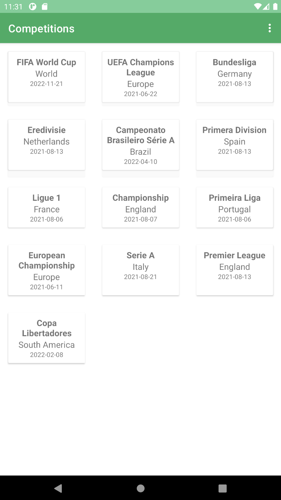
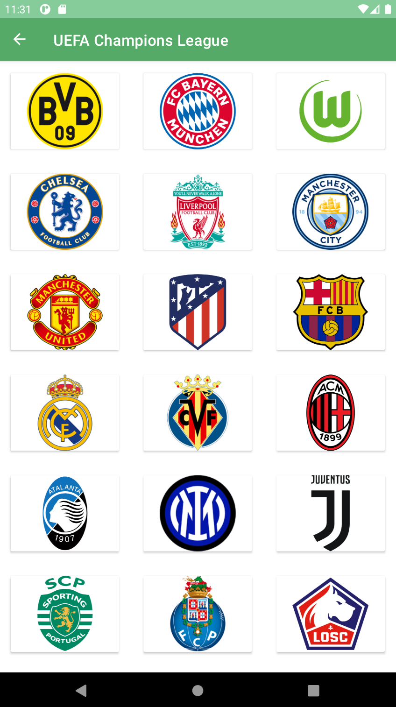
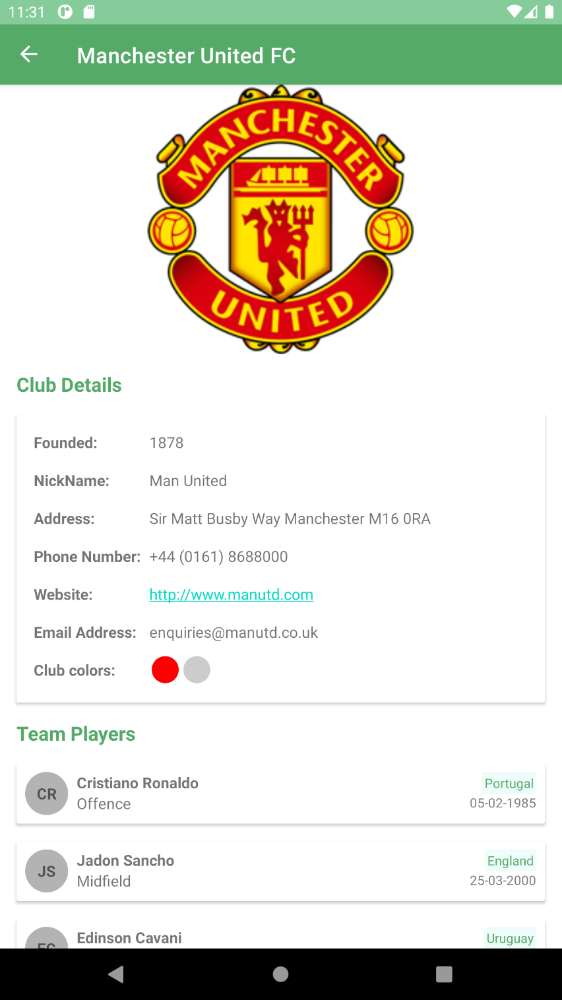

# MAON TECHNOLOGY ASSESSMENT

A simple 3 screens android Application.  
Get sport data from https://www.football-data.org/, persist locally some part of it, and display data on screen.

## Author

- [Francis Akpan](https://www.github.com/francisakpan)

Getting Started
---------------
This project uses the Gradle build system.  Clone the project from GitHub and open it using Android Studio.
This project was developed using Android Studio Bumblebee so make sure your IDE is updated.

Screenshots
-----------

Libraries Used
--------------
* [Architecture][10] - Jetpack architechure libraries. A collection of libraries  for managing app component lifecycles.
* [Android KTX][2] - Concise Kotlin code with less verbosity
* [Lifecycles][12] - Monitor lifecycle events and update UI accordingly

[0]: https://developer.android.com/jetpack/components
[2]: https://developer.android.com/kotlin/ktx
[4]: https://developer.android.com/training/testing/
[10]: https://developer.android.com/jetpack/arch/
[12]: https://developer.android.com/topic/libraries/architecture/lifecycle

## Documentation